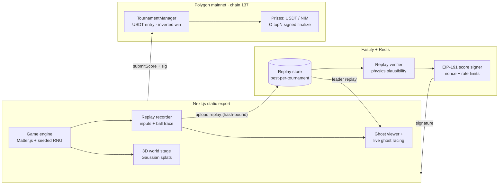

# Kamikaze Ball (神風)

> Drain-to-win pinball where the machine fights back. Built for the
> **Nimiq Pay Mini Apps Competition**.

Kamikaze Ball is a skill-based pinball game running inside the Nimiq Pay app.
You steer the ball INTO the drain while AI flippers try to save it. Fastest
drain wins. Onchain tournaments settle in **USDT** (Polygon) or **NIM** (Nimiq
native), with cryptographically signed scores, replay verification, and ghost
racing.

Built with **Next.js 16** (Turbopack, static export), Matter.js for physics,
**@nimiq/mini-app-sdk** for the Nimiq Pay integration, and ethers v6 for EVM
contract interaction. Practice is free and instant; tournaments require a
wallet and a 0.1 USDT or 1 NIM entry fee.

## What makes this different

- **Generative world stage:** the 2D playfield is composited inside a
  photoreal Marble Gaussian splat scene (Spark + Three.js). Tournaments are
  themed worlds, not just themed tables.
- **Chain-portable arcade economy:** prizes, entry fees, and micro-rewards
  work with any token (MUSD on Mezo, NIM on Nimiq, USDT on Polygon) via the
  ecosystem profile system. One codebase, many ecosystems.
- **O(topN) signed settlement:** `finalizeWithSignedWinners()` replaces
  on-chain sorting with an EIP-191 signed winner list — gas-efficient and
  generalizable.
- **Verifiable by nature:** pinball's full game state is one ball's position,
  velocity, and static body definitions — making it the most verifiable
  competitive game genre, and the foundation for a trustless arcade protocol.

See [docs/DIFFERENTIATORS.md](docs/DIFFERENTIATORS.md) for the full breakdown.

## For judges: 90-second tour

- **Instant guided demo:** append **`?demo=1`** to the app URL — skips onboarding and launches a narrated Kamikaze run.
- **No wallet needed:** the lobby attract mode shows the machine playing itself.
- **Demo script:** [docs/DEMO_SCRIPT.md](docs/DEMO_SCRIPT.md).



| Feature | Status | Where |
|---|---|---|
| Kamikaze mode (machine fights you, drain-time scoring, best-of-3) | ✅ live | `src/model/kamikaze.ts` |
| AI flippers + rubber-band difficulty + taunts | ✅ live | `src/model/kamikaze.ts` |
| Dueling power-ups (player munitions vs machine countermeasures) | ✅ live | `src/model/kamikaze.ts` |
| Deterministic replays (seeded RNG + input recording) | ✅ live | `src/model/replay-recorder.ts` |
| Server-side replay verification before signing | ✅ live | `backend/src/lib/replay-verifier.ts` |
| Ghost replay viewer + live ghost racing vs tournament leader | ✅ live | `src/game/ui/GhostRace.tsx` |
| Inverted-win tournaments on-chain (lower drain time wins) | ✅ deployed | `contracts/contracts/TournamentManager.sol` |
| O(topN) signed settlement (`finalizeWithSignedWinners`) | ✅ deployed | `backend/src/scripts/finalize-tournament.ts` |
| Lobby attract mode (machine plays itself) | ✅ live | `src/game/ui/ArcadeLobby.tsx` |

**Verification story:** every run records its RNG seed, all inputs, and a ball
position trace. The replay ships to the backend, its keccak hash is bound into
the EIP-191 signed metadata, and the verifier checks physics plausibility
(bounds, no teleports, drain segments vs claimed time, human input rates)
before any score is signed. Cheating requires forging a physically plausible
replay — not just POSTing a number.

## Ecosystem profiles

The app supports multiple blockchain ecosystems via env-based profiles. Set
`NEXT_PUBLIC_ECOSYSTEM_PROFILE` and related env vars to switch:

| Profile | Chain | Payment token | Wallet adapter |
|---|---|---|---|
| `nimiq` (production) | Polygon mainnet (137) | USDT (ERC-20) + NIM (native) | @nimiq/mini-app-sdk |
| `mezo` (legacy) | Mezo Testnet/Mainnet | MUSD (ERC-20) | Wagmi + RainbowKit |

See [.env.nimiq](.env.nimiq) for the complete Nimiq/Polygon mainnet profile.

## Live contracts

### Polygon Mainnet (production — Nimiq competition)

| Contract | Address |
|---|---|
| TournamentManager (USDT) | `0x39067C81a3ccc3184000b88b7466A4A77B59cfa0` |
| USDT (Tether) | `0xc2132D05D31c914a87C6611C10748AEb04B58e8F` |
| Entry fee | 0.1 USDT |
| NIM treasury | `NQ88 8AG0 1CXT 9Y11 77FU L706 M1TA R1FC DNKU` |

See [docs/NIMIQ_SETUP.md](docs/NIMIQ_SETUP.md) for the full deployment guide
and Nimiq Pay Mini App testing instructions.

## Architecture

Monorepo with three components:

- **Frontend**: Next.js 16.2 App Router → static export to `out/`. Game runs client-side only via `dynamic({ ssr: false })`.
- **Backend**: Node.js Fastify server for score signing and replay verification, with Redis-backed rate limiting.
- **Contracts**: Solidity (Hardhat) — TournamentManager + MissionPool, with EIP-191 signed finalization.

See [docs/ARCHITECTURE.md](docs/ARCHITECTURE.md) for the full domain-driven design, dependency rules, and test coverage breakdown.

## Features

- **Pinball Gameplay**: Retro-style vertically scrolling pinball with physics-driven gameplay (Matter.js + zCanvas)
- **Generative 3D Worlds**: Tables hosted inside photoreal Marble worlds rendered by Spark (Gaussian Splats on Three.js). See [docs/MARBLE_INTEGRATION.md](docs/MARBLE_INTEGRATION.md).
- **On-Chain Tournaments**: Enter by paying MUSD, compete for prizes distributed to top players via `finalizeWithSignedWinners()`
- **Wallet Integration**: Wagmi + RainbowKit with an explicit WalletPort adapter (no hidden globals)
- **Sentry Error Tracking**: Frontend crash reporting with global error boundary and instrumentation
- **Arcade Cabinet UX**: CRT overlay, neon marquee, and atmospheric lobby with tournament card selection
- **Leaderboard**: View tournament rankings and scores
- **Cross-Platform**: Responsive design with reduced-motion / low-end device fallback

## Frontend Setup

### Prerequisites
- Node.js 18+
- pnpm

### Installation

```bash
pnpm install
```

### Development

```bash
pnpm dev
```

Runs Next.js with Turbopack on `http://localhost:3000`.

### Production Build

```bash
pnpm build
```

Statically exports to `out/` — deploy to Netlify, Cloudflare Pages, or any CDN.

### Testing

```bash
pnpm test              # Frontend unit tests (65 tests, Vitest + jsdom)
pnpm run test:backend   # Backend API tests
pnpm run test:contracts # Contract tests (Hardhat)
pnpm run test:all       # All three suites

## Backend Setup

The backend provides a secure API for signing tournament scores.

### Prerequisites
- Node.js 18+
- A private key for score signing (generate with contracts/scripts/generate-key.js)

### Installation

```bash
cd backend
npm install
```

### Configuration

Copy the example environment file:

```bash
cp .env.example .env
```

Edit `.env` with your configuration:
- `SCORE_SIGNER_PK`: Private key for signing scores
- `PORT`: Server port (default: 8080)
- `ALLOWED_ORIGINS`: CORS allowed origins

### Running Locally

```bash
npm run dev
```

### Production Build

```bash
npm run build
npm start
```

## Contracts Setup

Smart contracts handle tournament logic on Mezo. Uses Hardhat (not Foundry).

### Prerequisites
- Node.js 18+
- Hardhat

### Installation

```bash
cd contracts
npm install
```

### Generate Test Keys

```bash
node scripts/generate-key.js
```

### Testing

```bash
npm test
```

New in this release: `finalizeWithSignedWinners()` replaces O(n^2) on-chain sorting with an EIP-191-signed winner list from the trusted backend signer. See `contracts/test/TournamentManager.test.ts` for the full test suite (10 tests, all passing).

## Active Tournament

Mezo Testnet (Chain ID: 31611):

- **TournamentManager**: `0x39067C81a3ccc3184000b88b7466A4A77B59cfa0`
- **MUSD**: `0x118917a40FAF1CD7a13dB0Ef56C86De7973Ac503`
- **Entry Fee**: 1 MUSD (configurable by owner)
- **Winners**: Top N players eligible for prizes (configurable per tournament)
- **Explorer**: https://explorer.test.mezo.org/

## Deployment

### Frontend

Statically exports to `out/`. Deploy to Netlify (configured via `netlify.toml`), Cloudflare Pages, Vercel, or any CDN.

### Backend

Deploy to a VPS or serverless platform. Requires Redis for rate limiting (optional — falls back to in-memory). See `backend/README.md` for systemd service, nginx reverse proxy setup, and `/admin/metrics` endpoint.

### Contracts

```bash
cd contracts
npm run deploy:mezotestnet
```

## Gameplay

1. **Connect Wallet**: Connect via RainbowKit to participate
2. **Enter Tournament**: Pay MUSD entry fee to join an active tournament
3. **Play Pinball**: Achieve high scores across themed worlds
4. **Submit Score**: Scores are EIP-191 signed by the backend and submitted on-chain
5. **Finalization**: Backend calls `finalizeWithSignedWinners()` to settle the tournament
6. **Claim Rewards**: Top players claim MUSD rewards from the TournamentManager contract

## Adding Custom Tables

To add a new pinball table:

1. Create new `TableDef` in `src/definitions/tables/`
2. Define Actors and Trigger behaviors
3. Add SVG collision map and PNG background assets
4. Update table selection in `src/definitions/tables.ts`

See existing table files for examples.

## API Reference

### Backend Endpoints

- `POST /api/scores/sign`: Sign a tournament score submission
  - Body: `{ tournamentId: number, address: string, score: number, name?: string, metadata?: string }` (metadata must be a valid JSON string)
  - Returns: `{ signature: string, nonce: string }`

## Security

- Tournament scores are cryptographically signed by the backend
- Smart contracts enforce tournament rules and prize distribution
- Wallet connections use standard Web3 security practices

## License

MIT License - see individual component repositories for details.
