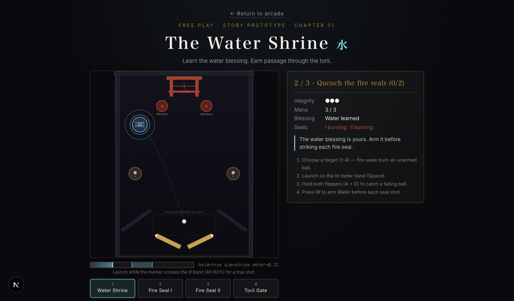
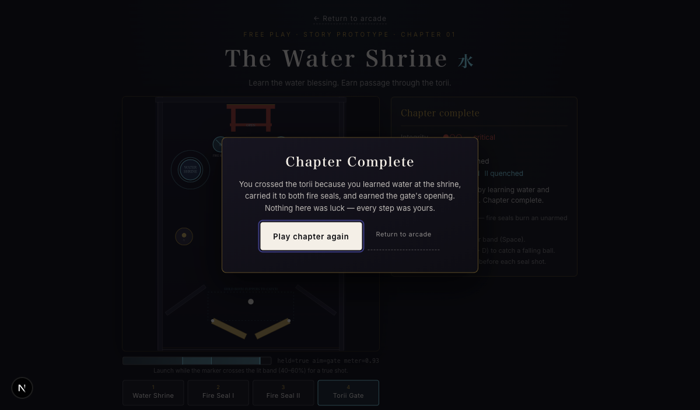
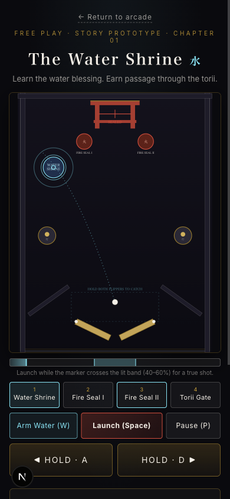

# Story Mode: The Water Shrine

Story mode turns the standalone chapter prototype into the game's narrative
spine: a guided chapter that teaches the game's core mechanic — **arming Water
(W) to quench fire seals** — on a real table, with the same engine, physics,
and input as arcade play. It is fully fenced from ranked systems: story runs
never record replays, submit scores, award XP, or touch ghosts.

## Where to find it

- **Lobby** — a "Story" chapter link under the tournament cards
  (`ChapterLink` in `ArcadeLobby.tsx`).
- **Route** — `/chapter` renders the same `GameScreen` the arcade uses, with
  `initialStory` set. There is no separate game code path: the story *is* the
  mounted game.
- **Pause menu** — a story summary card shows your integrity, seals, and
  progress while a run is paused.

## The run

1. **Reach the shrine.** The ball is served; a tick-based sensor body at the
   shrine captures it. First run, MAMORU teaches Water in an embedded lesson
   (the `ShrineChapter` trial component) — pass the trial to learn the
   element.
2. **Quench both seals.** Arm Water with **W**, then strike the two marked
   fire-seal targets. Striking an *unarmed* seal costs integrity — the table
   punishes spraying.
3. **Escape through the gate.** With both seals quenched, the gate sensor
   flips open; draining through it wins the chapter.
4. **Terminal states.** Win/lose cradles the ball at the plunger so it can
   never drop into the void behind the end dialog, and a `retry` relaunches
   clean rather than inheriting terminal fall velocity.

Integrity starts at 3. Draining before the gate is open costs 1; a failed
trial costs 1. At 0 integrity the chapter is lost.

## Architecture

The story reuses the arcade engine wholesale. Layering, top-down:

| Layer | File | Role |
|---|---|---|
| Route | `app/chapter/page.tsx` | Renders `GameScreen` with `initialStory` |
| Screen | `src/game/GameScreen.tsx` | Wires story auto-start, pause persistence, ranked guard |
| Mount | `src/game/GameMount.tsx` | Drives `handleEngineUpdate` per tick; routes story events |
| Model | `src/model/game.ts` | Skips replay/score/XP/ghost paths when story mode is active |
| Story table | `src/model/story-table.ts` | Attaches shrine/gate sensor bodies to the live Matter world; capture, re-serve, drain, terminal cradle |
| Story run | `src/model/story-run.ts` | Wraps the pure chapter reducer with `encounterId` for safe async trial results |
| Reducer | `src/model/shrine-chapter.ts` | Pure headless state machine (fully unit-testable) |
| Trial UI | `src/game/chapter/ShrineChapter.tsx` | The embedded lesson overlay component |

Key invariants, all covered by specs:

- **`encounterId` guards stale trial results** — a resolved trial promise from
  a previous encounter can never mutate the current state.
- **`drainArmed` / tick cooldowns** prevent double sensor fires; `emitOnce` +
  `fired.clear()` on re-serve keeps a run deterministic after re-serves.
- **Physics freeze during dialogs** (`storyFrozen`) — the world is paused
  while the lesson overlay is up; input gating (`shouldHandle` in
  `input-controller.ts`) lets flipper keyups pass through so a held flipper
  never sticks, while swallowing everything else.
- **Terminal cradle** — on `won`/`lost` from any prior phase, the ball is
  held at the plunger and terminal fall velocity is cleared.

## Test coverage

| Spec | Covers |
|---|---|
| `tests/unit/model/shrine-chapter.spec.ts` | Pure reducer: phases, seals, integrity |
| `tests/unit/model/story-run.spec.ts` | encounterId staleness, trial results, refill |
| `tests/unit/model/story-table.spec.ts` | Real-Matter physics rig: capture/release, seal quench, gate flip, drain re-serve, terminal cradle (lost mid-flight / lost from capture / won via gate / retry) |
| `tests/unit/game/chapter-stranding.spec.ts` | Standalone chapter table stranding guard |
| `tests/unit/game/story-integration.spec.ts` | `GameScreen` wiring: auto-start, pause persistence, ranked fencing (asserts `onRunEnd` never reaches `recordRun`) |

## Screenshots

*Mobile:* 
